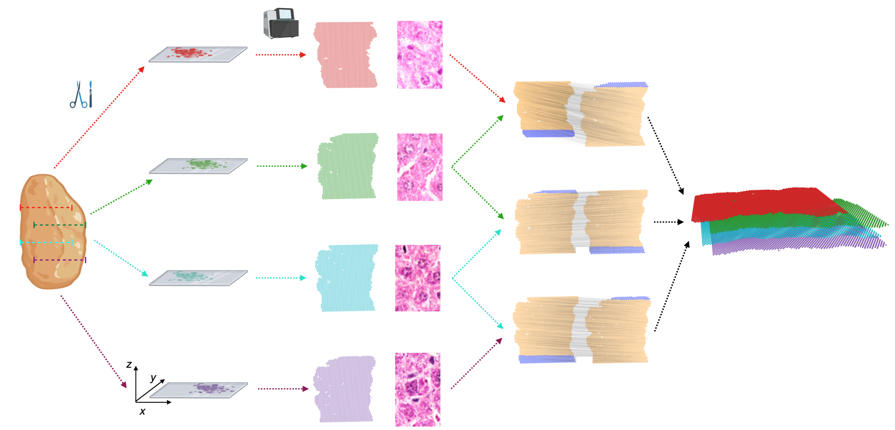

Welcome to PASTE3 documentation!
=================================

**PASTE3** package that provides combined functionality of PASTE and PASTE2.

PASTE Alignment
---------------
**PASTE** is a computational method that leverages both gene expression similarity and spatial distances between spots to align and integrate spatial transcriptomics data.

.. image:: _static/images/paste_overview.png
    :alt: PASTE Overview Figure
    :width: 800px
    :align: center
|

PASTE2 Alignment
----------------
**PASTE2**, the extension of PASTE, is a method for partial alignment and 3D reconstruction of spatial transcriptomics slices when they do not fully overlap in space.

PASTE3 Alignment
----------------

PASTE3 combines PASTE and PASTE2 to provide five main functionalities:

1. `Pairwise Alignment`: align spots across pairwise slices.
2. `Center Alignment`: integrate multiple slices into one center slice.
3. `Partial Pairwise Alignment`: given a pair of slices and their overlap percentage, find a partial alignment matrix.
4. `Select Overlap`: decide the overlap percentage between two slices
5. `Partial Stack Slices Pairwise`: given a sequence of consecutive slices and the partial alignments between them, project all slices onto the same 2D coordinate system. 3D reconstruction can be done by assigning a z-value to each slice.

.. toctree::
   :maxdepth: 1
   :caption: Contents:

   installation
   api
   tutorial
